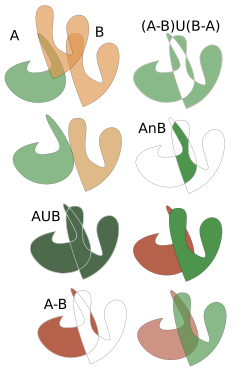

# Relaciones entre Formas

:::{.definition}
La forma es uno de los principales elementos de creación plástica. Gracias a ellas podemos representar imágenes tanto figurativas como abstracta. Por este motivo es importante entender como podemos trabajar las formas y como pueden convivir en nuestras creaciones.
:::

## Relaciones entre formas planas.

Las formas, además, se pueden *interrelacionar* determinando **figuras compuestas planas**. Las relaciones entre figuras planas se pueden resumir en:

### **Distanciamiento**: 
cuando las figuras guardan cierta separación entre ellas.
### **Toque**
cuando se rozan levemente (tangentes).
### **Unión** 
cuando los contornos de las dos figuras se complementan.
### **Sustracción**: 
cuando un contorno superpuesto resta al otro contorno su espacio.
### **Penetración**: 
ambas figuras son transparentes, superponiéndose.
### **Superposición**: 
las figuras se colocan una sobre otra, dejándose entrever ambas.
### **Intersección**
zona común a las dos figuras.
### **Transparencia**
 las dos figuras se superponen parcialmente pero, al ser translúcidas, se ven los contornos de ambas.

## Relaciones entre formas espaciales
