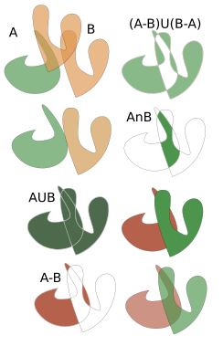

```{=tex}
\newcommand{\N}{\mathbb{N}}
\newcommand{\R}{\mathbb{R}}
\newcommand{\CC}{\mathbb{C}}
\newcommand{\I}{\mathbb{I}}
\newcommand{\f}{\mathbb{f}}
\newcommand{\X}{\mathbb{X}}
\newcommand{\D}{\mathbb{D}}
\newcommand{\Z}{\mathbb{Z}}
\newcommand{\Q}{\mathbb{Q}}
\newcommand{\norm}[1]{\left\Vert#1\right\Vert}
\newcommand{\abs}[1]{\left\vert#1\right\vert}
\newcommand{\set}[1]{\left\{#1\right\}}
\newcommand{\seq}[1]{\left<#1\right>}
\newcommand{\co}[1]{\left[#1\right]}
\newcommand{\cc}[1]{\left(#1\right)}
\newcommand{\J}{\mathcal{J}}
\newcommand{\K}{\mathcal{K}}
\newcommand{\M}{\mathcal{M}}
\newcommand{\F}{\mathcal{F}}
```
# Resumen {.unnumbered}

La importancia del estudio de la forma en el arte plástico se debe a la manipulación constante de estas en el espacio bidimensional y tridimensional. En el plano bidimensional se estudian aspectos geometricos partiendo desde la forma de un punto hasta formas orgánicas con comportamientos similares al de los conjuntos fractales de Mandelbrot y Julia y en el espacio tridimensional se realiza un estudio sobre formas que viven en este espacio es decir tanto las formas bidimensionales además de los sólidos geométricos y las formas orgánicas y los conjuntos fractales de Mandelbrots 3D y julia 3D. Finalmente se realiza composiciones con estas formas, utilizando principios de composicon plástica con el objetivo de reunir los conocimientos previos y reconocer la utilidad de su estudio previo. Luego se reconocerán estas formas como contenedores de formas existentes en la naturaleza tales como las formas estudiadas en la fitomorfología, la zoomorfología, la geomorfologia. En el Apendice se describen conceptos relacionados a transformaciones y centros de masa de formas 2d y 3d.

# Introducción {.unnumbered}


El **diseño gráfico** es un proceso creativo que consiste en **transmitir un mensaje** a través de una *comunicación visual*. Dentro de este proceso, existe lo que se conoce como *principios de la composición* en diseño gráfico.

Entendemos por **composición** como la **disposición** de los elementos sobre un plano o el espacio. Dichos *elementos* pueden ser de distintos tipos. Se trata de una clase de **reglas** que sirven como **guía**, no como leyes, y permiten **construir y comunicar** el mensaje, para que éste se transmita de la forma más exitosa posible.

<!--chapter:end:index.Rmd-->

\mainmatter

# Elementos básicos del diseño

Comencemos detallando los 6 elementos básicos con los que un diseñador puede crear sus composiciones. ¿Cuáles son los 6 elementos que puede contener un diseño? Todos, sin excepción, disponen de alguno de ellos:

*   **Línea**. Quizás el más básico. Todo comienza con una línea. Una línea corta puede verse como un punto.

*   **Dirección**. Todas las líneas tienen una dirección y según cual sea, puede provocar diferentes percepciones. Por ejemplo: una línea vertical da sensación de altura, una horizontal de estabilidad, una en diagonal, crecimiento (si va de menos a más, de izquierda a derecha) o descenso (si va de más a menos, de izquierda a derecha). ¿Te lo habías planteado?

*   **Forma**. Línea + dirección = forma. Las formas están compuestas por líneas, bien cerradas o abiertas (y aquí es donde entra, por ejemplo la Ley de Cierre de Gestalt, donde el cerebro "cierra" o "une" esos espacios). Pueden ser líneas explícitas, o bien utilizando otros principios como el contraste, o elementos como el color, que también crean formas.

*   **Tamaño**. El tamaño también es un elemento importante de todo diseño. Un mismo elemento repetido en dos tamaños diferentes pueden provocar sensaciones diferentes: tamaño (propiamente dicho), distancia o jerarquía.

*   **Color**. Un elemento fundamental. Y por color, entendemos todos: blanco, negro, rojo, azul, etc. El color nos ayuda a contrastar elementos y no olvidemos su peso emocional, donde cada color tiene varios significados. Por ejemplo: el color blanco transmite pureza, paz, limpieza, perfección... El color se compone de 3 valores: color (verde), saturación (cantidad de verde puro, su ausencia es una escala de grises) y brillo (luminosidad del color, más próximo al blanco o al negro).

*   **Textura**. Un derivado del color. La textura añade ese toque extra de realidad, ya que en la naturaleza no solemos encontrar objetos con colores planos 100%, y la textura nos aporta una información extra de la superficie del objeto. Principios de la composición

# Principios de la composición o diseño

Se consideran los siguientes principios:

## Énfasis o punto focal

:::{#wwwwwwwwwwwww .definition name="name"}
Este otro principio de la composición se basa en un elemento que domina sobre el resto en condición de subordinación. Dentro de la jerarquía, encontramos 3 subtipos:

*   Alineación
*   Escala
*   Color
*   Forma
:::

<iframe title="Cthulhu (Animated)" frameborder="0" allowfullscreen mozallowfullscreen="true" webkitallowfullscreen="true" allow="fullscreen; autoplay; vr" xr-spatial-tracking execution-while-out-of-viewport execution-while-not-rendered web-share width="100%" height="480" src="https://sketchfab.com/models/e4593e6681e84889a4d1df34ae30b5c6/embed">
</iframe>

<a href="https://sketchfab.com/3d-models/cthulhu-animated-e4593e6681e84889a4d1df34ae30b5c6?utm_medium=embed&utm_campaign=share-popup&utm_content=e4593e6681e84889a4d1df34ae30b5c6" target="_blank" style="font-weight: bold; color: #1CAAD9; "> Cthulhu (Animated) </a> by <a href="https://sketchfab.com/nathanwondrak?utm_medium=embed&utm_campaign=share-popup&utm_content=e4593e6681e84889a4d1df34ae30b5c6" target="_blank" style="font-weight: bold; color: #1CAAD9; "> Nathan Wondrak </a> on <a href="https://sketchfab.com?utm_medium=embed&utm_campaign=share-popup&utm_content=e4593e6681e84889a4d1df34ae30b5c6" target="_blank" style="font-weight: bold; color: #1CAAD9; ">Sketchfab</a>

<iframe title="Fractal Pagoda • ©Ashim Shakya" frameborder="0" allowfullscreen mozallowfullscreen="true" webkitallowfullscreen="true" allow="fullscreen; autoplay; vr" xr-spatial-tracking execution-while-out-of-viewport execution-while-not-rendered web-share width="100%" height="480" src="https://sketchfab.com/models/a639a0cac8d44b9fb8a5ffbec7a4d0a0/embed">
</iframe>

<a href="https://sketchfab.com/3d-models/fractal-pagoda-ashim-shakya-a639a0cac8d44b9fb8a5ffbec7a4d0a0?utm_medium=embed&utm_campaign=share-popup&utm_content=a639a0cac8d44b9fb8a5ffbec7a4d0a0" target="_blank" style="font-weight: bold; color: #1CAAD9; "> Fractal Pagoda • ©Ashim Shakya </a> by <a href="https://sketchfab.com/ashimshakya?utm_medium=embed&utm_campaign=share-popup&utm_content=a639a0cac8d44b9fb8a5ffbec7a4d0a0" target="_blank" style="font-weight: bold; color: #1CAAD9; "> Ashim Shakya </a> on <a href="https://sketchfab.com?utm_medium=embed&utm_campaign=share-popup&utm_content=a639a0cac8d44b9fb8a5ffbec7a4d0a0" target="_blank" style="font-weight: bold; color: #1CAAD9; ">Sketchfab</a>

<iframe title="Dragon Curve 2" frameborder="0" allowfullscreen mozallowfullscreen="true" webkitallowfullscreen="true" allow="fullscreen; autoplay; vr" xr-spatial-tracking execution-while-out-of-viewport execution-while-not-rendered web-share width="100%" height="480" src="https://sketchfab.com/models/e91edbc4046c4d28ba1976fe47ff9fde/embed">
</iframe>

<a href="https://sketchfab.com/3d-models/dragon-curve-2-e91edbc4046c4d28ba1976fe47ff9fde?utm_medium=embed&utm_campaign=share-popup&utm_content=e91edbc4046c4d28ba1976fe47ff9fde" target="_blank" style="font-weight: bold; color: #1CAAD9; "> Dragon Curve 2 </a> by <a href="https://sketchfab.com/tatasz?utm_medium=embed&utm_campaign=share-popup&utm_content=e91edbc4046c4d28ba1976fe47ff9fde" target="_blank" style="font-weight: bold; color: #1CAAD9; "> tatasz </a> on <a href="https://sketchfab.com?utm_medium=embed&utm_campaign=share-popup&utm_content=e91edbc4046c4d28ba1976fe47ff9fde" target="_blank" style="font-weight: bold; color: #1CAAD9; ">Sketchfab</a>

## Equilibrio o balance

:::{#w .definition name="Equilibrio"}
El equilibrio se basa en la organización de los elementos de modo que **nada domine en el plano o bien para que una parte pese más que la otra**.
:::

Existen dos tipos de equilibrio: la simetría y la asimetría.

-   **Balance Simétrico**: se da cuando los elementos se disponen simétricamente a ambos lados de los ejes, horizontal o vertical.

-   **Balance Asimétrico**: se da cuando los elementos no mantienen simetría por forma, pero sí por peso visual.

<iframe title="The Tripled" frameborder="0" allowfullscreen mozallowfullscreen="true" webkitallowfullscreen="true" allow="fullscreen; autoplay; vr" xr-spatial-tracking execution-while-out-of-viewport execution-while-not-rendered web-share width="100%" height="480" src="https://sketchfab.com/models/38529b783aa54b58b09f911b02c98f77/embed">
</iframe>

<a href="https://sketchfab.com/3d-models/the-tripled-38529b783aa54b58b09f911b02c98f77?utm_medium=embed&utm_campaign=share-popup&utm_content=38529b783aa54b58b09f911b02c98f77" target="_blank" style="font-weight: bold; color: #1CAAD9;"> The Tripled </a> by <a href="https://sketchfab.com/3dfractalart?utm_medium=embed&utm_campaign=share-popup&utm_content=38529b783aa54b58b09f911b02c98f77" target="_blank" style="font-weight: bold; color: #1CAAD9;"> Peter Petrov </a> on <a href="https://sketchfab.com?utm_medium=embed&utm_campaign=share-popup&utm_content=38529b783aa54b58b09f911b02c98f77" target="_blank" style="font-weight: bold; color: #1CAAD9;">Sketchfab</a>

<iframe title="Fractal Tree3D Test" frameborder="0" allowfullscreen mozallowfullscreen="true" webkitallowfullscreen="true" allow="fullscreen; autoplay; vr" xr-spatial-tracking execution-while-out-of-viewport execution-while-not-rendered web-share width="100%" height="500" src="https://sketchfab.com/models/91fda5ff46054cb8af9449e92dc00f59/embed">
</iframe>

<a href="https://sketchfab.com/3d-models/fractal-tree3d-test-91fda5ff46054cb8af9449e92dc00f59?utm_medium=embed&utm_campaign=share-popup&utm_content=91fda5ff46054cb8af9449e92dc00f59" target="_blank" style="font-weight: bold; color: #1CAAD9;"> Fractal Tree3D Test </a> by <a href="https://sketchfab.com/fishbait?utm_medium=embed&utm_campaign=share-popup&utm_content=91fda5ff46054cb8af9449e92dc00f59" target="_blank" style="font-weight: bold; color: #1CAAD9;"> Lars Magnus Nyland </a> on <a href="https://sketchfab.com?utm_medium=embed&utm_campaign=share-popup&utm_content=91fda5ff46054cb8af9449e92dc00f59" target="_blank" style="font-weight: bold; color: #1CAAD9;">Sketchfab</a>


## Ritmo o movimiento

El principio del ritmo consiste en la **repetición de elementos** con el fin de conseguir una **composición harmoniosa**. Dicha repetición puede ser **constante o alterna**, afectadas por el color, la forma, etc.

Este principio pretende expresar el movimiento en la composición y existen dos clases:

-   **Regular**, cuando el movimiento es uniforme y constante
-   **Progresivo**, cuando el movimiento es alterno y varía.

El ritmo es la secuencia con que aparecen los elementos que componen el diseño: el orden, la repetición y la forma de organizarlos.

Si se usa correctamente este principio puede ser realmente muy útil para asegurar una correcta lectura de nuestro diseño.

El ritmo de una composición puede ser:

Radial: Si los elementos se disponen de forma circular Lineal: Si la disposición de los elementos da una forma de continuidad.


## Proporción o Escala

El **principio de proporción** se basa en la relación del **tamaño** de los objetos con la composición final. La proporción nos ayuda a comunicar la **relación entre los diferentes elementos de diseño**. También puede ayudarnos a **marcar como más importante alguna parte en concreto**, ya que los elementos grandes captan más atención que los pequeños.

La rporcion o escala es una de las trasformciones elementales (Traslación rotación, escala y reflexión)

Dentro del principio de escala podemos tener en cuenta 3 subcategorías:

*   **Tamaño**: cuando nos encontramos con elementos de diferentes tamaños relacionados entre sí.

*   **Proporción**: elementos relacionados unos con otros, en una proporción visualmente armónica.

*   **División**: elementos divididos en diferentes tamaños, creando todos ellos una unidad.

<iframe title="Julia3D 5 Torus" frameborder="0" allowfullscreen mozallowfullscreen="true" webkitallowfullscreen="true" allow="fullscreen; autoplay; vr" xr-spatial-tracking execution-while-out-of-viewport execution-while-not-rendered web-share width="100%" height="500" src="https://sketchfab.com/models/75c8703899fd47ab93cc78571d4b5f41/embed">
</iframe>

<a href="https://sketchfab.com/3d-models/julia3d-5-torus-75c8703899fd47ab93cc78571d4b5f41?utm_medium=embed&utm_campaign=share-popup&utm_content=75c8703899fd47ab93cc78571d4b5f41" target="_blank" style="font-weight: bold; color: #1CAAD9; "> Julia3D 5 Torus </a> by <a href="https://sketchfab.com/Aiekick?utm_medium=embed&utm_campaign=share-popup&utm_content=75c8703899fd47ab93cc78571d4b5f41" target="_blank" style="font-weight: bold; color: #1CAAD9; "> Aiekick </a> on <a href="https://sketchfab.com?utm_medium=embed&utm_campaign=share-popup&utm_content=75c8703899fd47ab93cc78571d4b5f41" target="_blank" style="font-weight: bold; color: #1CAAD9; ">Sketchfab</a>

## Unidad

Este principio de la composición tiene lugar cuando un conjunto de **elementos** se **organizan y se relaciona entre sí**; de manera que acaban representando un **solo elemento**.

Dentro del **principio de unidad**, encontramos 3 variantes (sub-principios):

*   **Repetición**: cuando el uso de un mismo elemento se utiliza repetidamente para construir la composición.

*   **Principio de Sucesión**: Se logra cuando se usa recurrentemente un color o un elemento donde uno de ellos mantiene el punto focal.

*   **Continuidad**: cuando los elementos se articulan entorno a la construcción del mensaje.

*   **Proximidad**: cuando se utiliza el mismo elemento para construir bloques en la composición.

    -   **Crear conexiones**: La proximidad puede generar una relación entre dos objetos, generar relevancia, jerarquía, estructurar

    -   **Disipar conexiones**: La proximidad también puede reflejar la carencia de relación entre elementos.

<iframe title="Julia Revolute High Res" frameborder="0" allowfullscreen mozallowfullscreen="true" webkitallowfullscreen="true" allow="fullscreen; autoplay; vr" xr-spatial-tracking execution-while-out-of-viewport execution-while-not-rendered web-share width="100%" height="500" src="https://sketchfab.com/models/963527bd08f5427997809eec85e0cac2/embed">
</iframe>

<a href="https://sketchfab.com/3d-models/julia-revolute-high-res-963527bd08f5427997809eec85e0cac2?utm_medium=embed&utm_campaign=share-popup&utm_content=963527bd08f5427997809eec85e0cac2" target="_blank" style="font-weight: bold; color: #1CAAD9; "> Julia Revolute High Res </a> by <a href="https://sketchfab.com/Aiekick?utm_medium=embed&utm_campaign=share-popup&utm_content=963527bd08f5427997809eec85e0cac2" target="_blank" style="font-weight: bold; color: #1CAAD9; "> Aiekick </a> on <a href="https://sketchfab.com?utm_medium=embed&utm_campaign=share-popup&utm_content=963527bd08f5427997809eec85e0cac2" target="_blank" style="font-weight: bold; color: #1CAAD9; ">Sketchfab</a>

Y no debemos olvidar que también podemos otorgar unidad mediante la armonía con el uso de colores análogos o mediante el contraste con el uso de colores complementarios, como puede verse aquí abajo.


```{r w, echo=FALSE, out.width='100%', out.height='100%', fig.align="center", fig.cap="Proporción de un polígono"}
if (knitr::is_html_output()) {
knitr::include_url("https://www.geogebra.org/classic/dgs4uvkb", height="700")} else {
knitr::include_graphics('proporcion.svg')
}
```


```{r ww, echo=FALSE, out.width='100%', out.height='100%', fig.align="center", fig.cap="Proporción de un polígono"}
if (knitr::is_html_output()) {
knitr::include_url("https://www.geogebra.org/classic/nudpfupw", height="700")} else {
knitr::include_graphics('proporcion.svg')
}
```

<!--chapter:end:01.Rmd-->

#  Relaciones entre Formas
  
  
  
:::{.definition}
La forma es uno de los principales elementos de creación plástica. Gracias a ellas podemos representar imágenes tanto figurativas como abstracta. Por este motivo es importante entender como podemos trabajar las formas y como pueden convivir en nuestras creaciones.
:::
  
  
Las formas, además, se pueden *interrelacionar* determinando **figuras compuestas**. Las relaciones entre figuras planas se pueden resumir en:
  
1. **Distanciamiento**: cuando las figuras guardan cierta separación entre ellas.
2. **Toque**: cuando se rozan levemente (tangentes).
3. **Unión**: cuando los contornos de las dos figuras se complementan.
4. **Sustracción**: cuando un contorno superpuesto resta al otro contorno su espacio.
5. **Penetración**: ambas figuras son transparentes, superponiéndose.
6. **Superposición**: las figuras se colocan una sobre otra, dejándose entrever ambas.
7. **Intersección**: zona común a las dos figuras.
8. **Transparencia**: las dos figuras se superponen parcialmente pero, al ser translúcidas, se ven los contornos de ambas.
  
##  Relaciones entre formas planas.
  
Las relaciones entre formas pueden ser las siguientes:
  
  
```{r
if (knitr::is_html_output()) {
knitr::include_url("https://www.geogebra.org/classic/wdkjjtjp", height="700")} else {
knitr::include_graphics('elipse.svg')
}
```
  
###  Distanciamiento.
  
  
Dos formas mantienen una relación de distanciamiento cuando existe una separación entre ellas.
  
###  Toque.
  
Existe relación de toque cuando las formas están en contacto.
  
Relación de formas por toque
Jugando con la sensación de equilibrio, estas formas circulares y semicirculares se mantienen unidas por un ligero contacto.
###  Superposición.
  
Existe superposición cuando una forma tapa a otra y de esta solo vemos la parte que no está tapada.
  
Iconos chat con relación de formas por superposición
Icono de chat con dos bocadillos de diálogo que se superponen. Sin duda, esta es la relación más habitual entre formas.
  
###  Unión.
  
  
Dos formas tienen una relación de unión cuando se funde y los contornos de las dos formas se complementan.
  
Icono de mostrador con relación de formas por unión
En este icono las dos figuras que representan personas y el mostrador se funden en una única forma.
Portada de The last of us
En esta carátula del videojuego The last of us vemos que mediante la sombra ambos personajes funden sus formas y se aprecian como una única forma. Sin duda, demás de ser un recurso estético, sirve para remarcar la estrecha unión entre los dos personajes.
  
  
###  Intersección.
  
  
Existe relación de intersección entre dos formas cuando surge una nueva forma fruto de la zona común entre ellas. Es decir, ambas formas comparten una superficie del plano y esta genera una nueva forma.
  
Cartel de la película Her con relación de formas por intersección.
En este cartel de la películar Her vemos solo una parte de la vista frontal del rostro tras la intersección y recorte con una vista de perfil de la que solo vemos algunos detalles mínimos.
  
  
###  Sustracción.
  
  
La relación de sustracción se produce cuando una forma no aparece representada, pero resta el espacio común a la otra creando un vacío.
  
Icono madre y bebe. Relación de formas por sustracción
En este icono se ha representado una figura cuidando de un niño. La figura del niño se ha sustraído de la forma del adulto. Es un recurso útil para imágenes que pretenden ser formalmente simples.
  
###  Penetración.
  
  
Existe relación de penetración entre formas cuando se crea un vacío en el espacio común entre ellas.
  
Relación de penetración entre formas
En esta imagen vemos que de la penetración entre dos formas surge una nueva.
  
###  Transparencia.
  
  
En una relación de transparencia entre formas, ambas formas comparten un espacio en común, pero se aprecia el contorno de ambas. Podemos entenderlo como una superposición de una forma translúcida sobre otra.
  
Relaciones entre formas por transparencia y superposición
En esta obra de Petra Erikson el rostro que está de medio perfil tiene una relación de superposición sobre la otra figura que está de frente. En cambio, su pelo mantiene una relación de transparencia, dejando ver el rostro frontal con una suma aditiva de colores.
  
  
<p align="center"></p>  
  
wwwwwwwwwwwwwwwwwwwwwwwwwwl plano Here is a review of existing methods.
```{r

```
  
  
##  Superficies poliedricas
  
  
www
  
###  Solidos platónicos
  
  
###  Los prismas
  
  
##  Superficies de revolucion y regladas
  
  
##  Superficies curvas
  
  
###  Cerradas
  
  
Esfera Elipsoide
  
###  Abiertas
  
  
###  Orientables
  
  
###  No orientables
  
  
##  Fractales 3D
  
  
##  Desarrollo de forma tridimensionales
  
  
  
  

<!--chapter:end:02_.Rmd-->

# Relaciones entre Formas


:::{.definition}
La forma es uno de los principales elementos de creación plástica. Gracias a ellas podemos representar imágenes tanto figurativas como abstracta. Por este motivo es importante entender como podemos trabajar las formas y como pueden convivir en nuestras creaciones.
:::


## Relaciones entre formas planas.


Las formas, además, se pueden *interrelacionar* determinando **figuras compuestas planas**. Las relaciones entre figuras planas se pueden resumir en:

### **Distanciamiento**: 
cuando las figuras guardan cierta separación entre ellas.
### **Toque**
cuando se rozan levemente (tangentes).
### **Unión** 
cuando los contornos de las dos figuras se complementan.
### **Sustracción**: 
cuando un contorno superpuesto resta al otro contorno su espacio.
### **Penetración**: 
ambas figuras son transparentes, superponiéndose.
### **Superposición**: 
las figuras se colocan una sobre otra, dejándose entrever ambas.
### **Intersección**
zona común a las dos figuras.
### **Transparencia**
 las dos figuras se superponen parcialmente pero, al ser translúcidas, se ven los contornos de ambas.


## Relaciones entre formas espaciales

<!--chapter:end:02.Rmd-->

# Composición de formas

## Operaciones con formas

### Union

```{definition}
wwwwwwwwwwwwwwwwwwwwwww
```

### Interseccion

### Diferencia

### Diferencia simetrica

### Complemento

## Componiendo escenas

### Utilizando software

### El bodegon

### La superficie

### wwwwwwwwwww
## Simetrías
### Simetría axial
### Simetría radial o puntual
### Simetría esferica
### Simetría planar

<!--chapter:end:03.Rmd-->

# Formas organicas

## Geometrizacion

## Redes

## Geomorfologia

## Fitomorfologia

## Zoomorfologia

<!--chapter:end:04.Rmd-->

# Formas abstractas

## Caos y orden

[@bookdown2016]wwwwwww [@vincze2014college]

## Ejercicios

wwwwwwwwwwwwwwwwwwwwwwwwwwwwwwwwwwww

<!--chapter:end:05.Rmd-->

# Formas Matematicas
```{r nice-tab, message=TRUE, paged.print=TRUE, tidy=FALSE}
knitr::kable(
  head(iris, 20), caption = 'Here is a nice table!',
  booktabs = TRUE
)
```
wwwwwwwwwwwwwwwwwwwwwwwwwww

## Funciones

wwwwwwwwww\index{wwwwwwww} [@vincze2014college]

## Ejercicios

<!--chapter:end:06.Rmd-->

# (APPENDIX) Apendice {.unnumbered}

Temas de reforzamiento o conocimientos preliminares que son necesarias para entender el contenido.

# Trasformaciones

Se refiere a las transformaciones o modificaciones que pueden sufrir las formas, es decir los achatamientos, las elongaciones los cambios de posición etc., mediante la manipulación de los puntos pertenecientes a la forma.

```{definition, transformacion, name="Transformación"}
Una transformacion es el proceso de modificar una forma covirtiendola en otra
```

## Trasformaciones elementales

En esta sección se trata sobre la trasformaciones básicas que son la traslación, la rotación, la reflexión y la homotescia o escala

### Traslacion

```{definition, traslacion, name="Traslación"}
La traslacion de un objeto, consiste en mover todos los puntos del objeto en el espacio 2D o 3D en una solo dirección, un solo sentido y a una distancia determinada.
```

```{example}
Sea figura (\@ref(fig:Doge)) la derección de $37^\circ$, el sentido indicada por la flecha y la distancia 5 unidades.
```

www

```{r Doge, echo=FALSE, fig.align="center", fig.cap="Hola"}
if (knitr::is_html_output()) {
knitr::include_url("https://www.youtube.com/embed/TTpbP5BVtiA")
knitr::include_graphics('elipse.svg')
  } else {
knitr::include_graphics('elipse.pdf')
}
```

```{example}
www wwwwwwwwwwww wwwwwwwwwwwwwww
```

En la escala u homotescia también existen procedimientos de proporción \@ref(fig:Doge)

### Rotacion

```{definition, rotacion, name="Traslación"}
La traslacion es el proceso de mover todos los puntos de un objeto en el espacio 2D o 3D en una solo dirección y sentido a una distancia determinada 
```

### Reflexión

La traslacion es el proceso de mover todos los puntos de un objeto en el espacio 2D o 3D en una solo dirección y sentido a una distancia determinada

### Homotescia

La traslacion es el proceso de mover todos los puntos de un objeto en el espacio 2D o 3D en una solo dirección y sentido a una distancia determinada

## Trasformaciones topológicas

La traslacion es el proceso de mover todos los puntos de un objeto en el espacio 2D o 3D en una solo dirección y sentido a una distancia determinada

### Homeomofismo

La traslacion es el proceso de mover todos los puntos de un objeto en el espacio 2D o 3D en una solo dirección y sentido a una distancia determinada

### Homomorfismo

La traslacion es el proceso de mover todos los puntos de un objeto en el espacio 2D o 3D en una solo dirección y sentido a una distancia determinada [@xie2015]

### Isomorfismo

### Isometría

# Centro de masa

## Centro de masa de objetos 2D

### Metodos matematicos

### Metodos tecnicos

#### Método del borde de la mesa

#### Método de la plomada

## Centro de masa de objetos 3D

### Metodos matematicos

### Metodos tecnicos

#### Método de las secciones

#### Método de la plomada

<!--chapter:end:07.Rmd-->

`r if (knitr::is_html_output()) '
# Referencias {-}
'`

<!--chapter:end:08.Rmd-->

